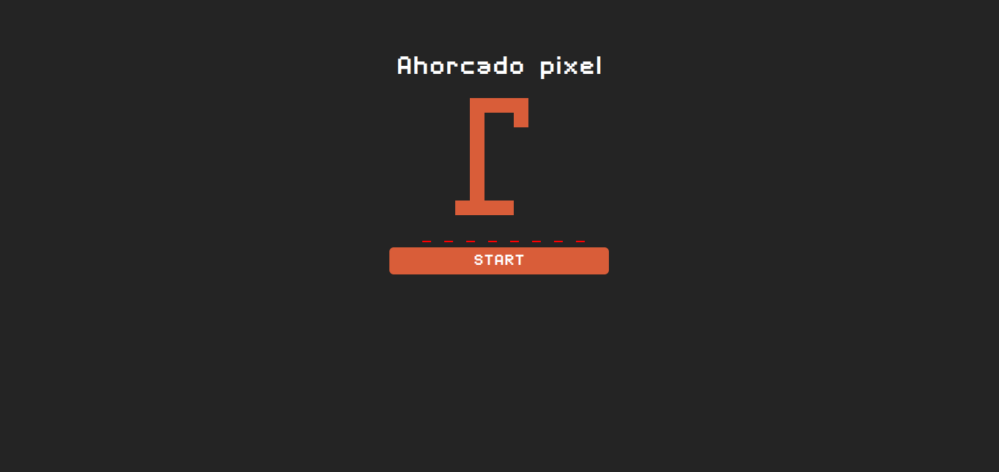

# 🎮 Juego del Ahorcado - Pixel Art

Un juego clásico del ahorcado con gráficos en pixel art, desarrollado con **HTML, CSS y JavaScript**, y utilizando **Vite** para un entorno de desarrollo rápido.

## 📷 Capturas de Pantalla



---

## 📥 Instalación

Sigue estos pasos para ejecutar el juego en tu entorno local:

### 1️⃣ Clona el repositorio:

```sh
git clone https://github.com/tuusuario/juego-del-ahorcado.git
```

### 2️⃣ Entra en la carpeta del proyecto:

```sh
cd juego-del-ahorcado
```

### 3️⃣ Instala las dependencias:

```sh
npm install
```

### 4️⃣ Ejecuta el proyecto en modo desarrollo:

```sh
npm run dev
```

Esto iniciará un servidor de desarrollo con **Vite** y podrás acceder al juego en `http://localhost:5173/` _(o el puerto que asigne Vite)._

### 5️⃣ Compila el proyecto para producción:

```sh
npm run build
```

Esto generará una carpeta `dist/` lista para ser desplegada en un servidor.

---

## 🚀 Uso

1. **Haz clic en "Start"** para comenzar el juego.
2. **Escribe una letra en el teclado** para adivinar la palabra oculta.
3. Si aciertas, la letra aparecerá en su posición correcta.
4. Si fallas, se dibujará una parte del ahorcado.
5. **Ganas si adivinas la palabra antes de completar el dibujo.**
6. **Pierdes si cometes 6 errores.**

### 📱 Compatibilidad con dispositivos táctiles

- En móviles y tablets, se activa un **campo de entrada invisible** para capturar letras.
- En computadoras, el juego usa eventos de teclado (`keyup`).

---

## ⚙️ Tecnologías Utilizadas

- **HTML5** – Estructura del juego.
- **CSS3** – Estilos y diseño.
- **JavaScript (ES Modules)** – Lógica del juego.
- **Canvas API** – Dibujo del ahorcado.
- **Vite** – Entorno de desarrollo rápido.

**¡Disfruta jugando al Ahorcado Pixel! 🎮**
